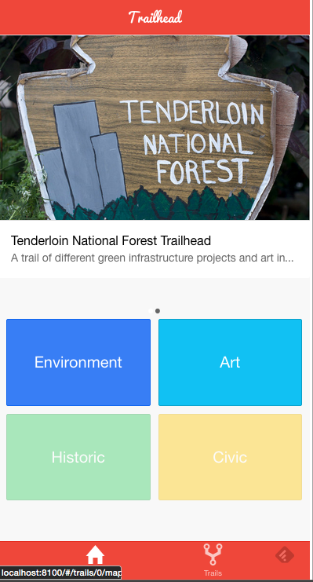
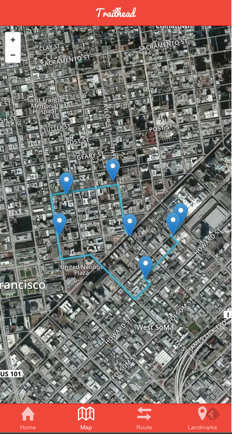
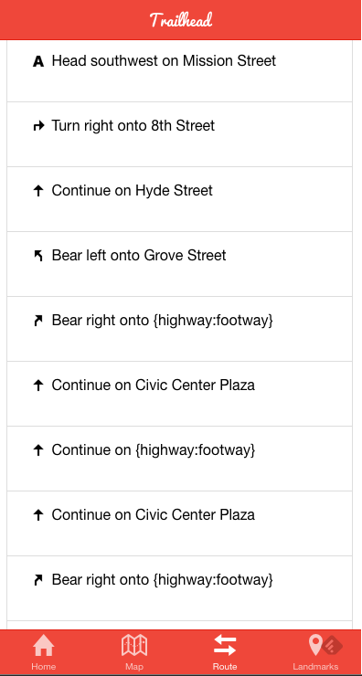

An Urban Trail Map for San Francisco.

Implemented using the Ionic Framework, Leaflet and Mapbox
Uses the Mapbox Direction API in order to create directions and routes.

Running express.js, and node.js on the backend.

*Landing Page*

*Route View*

*Directions View*

For contributions just add a pull request.
